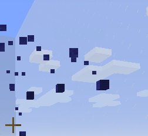
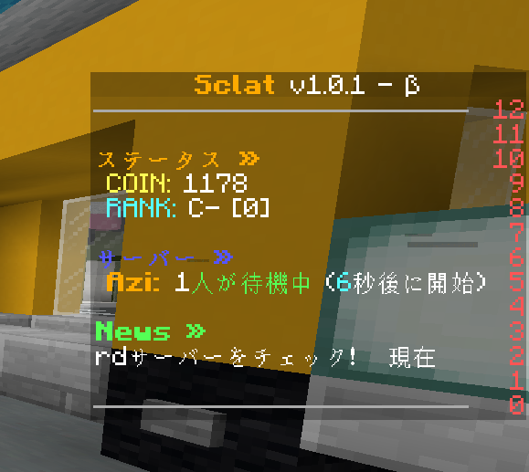
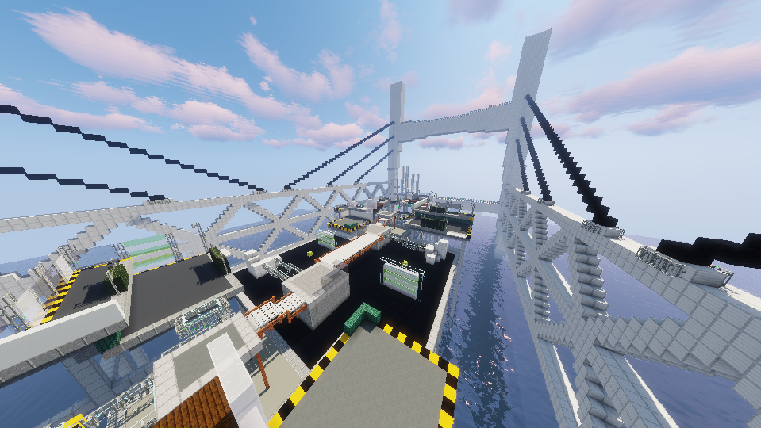
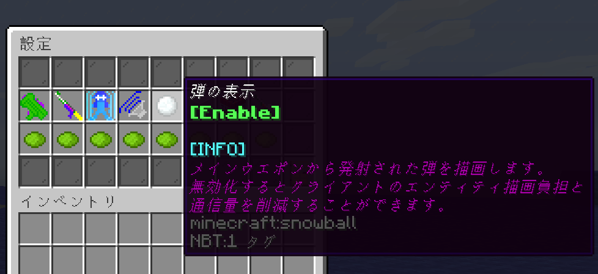
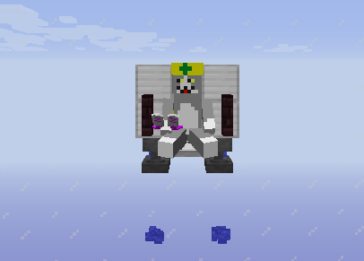
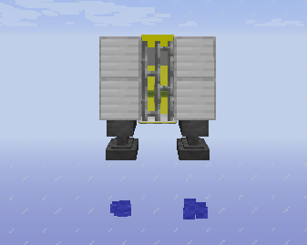
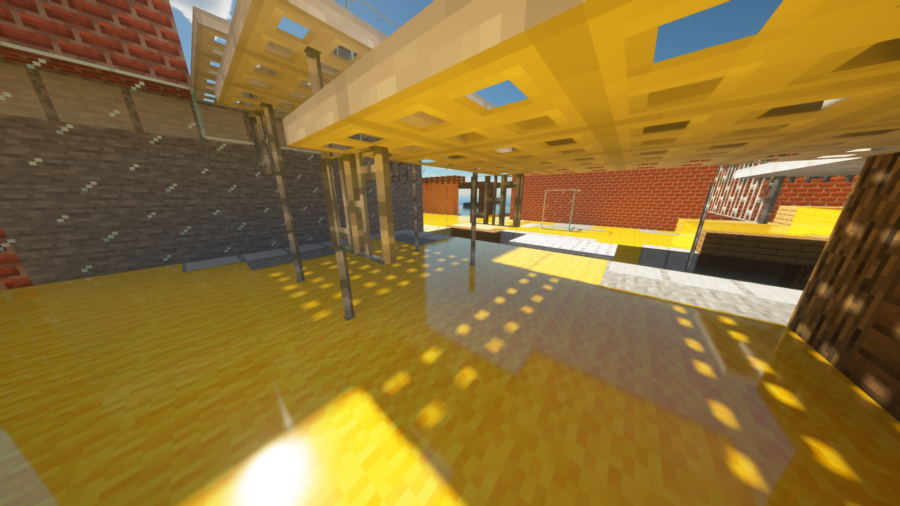
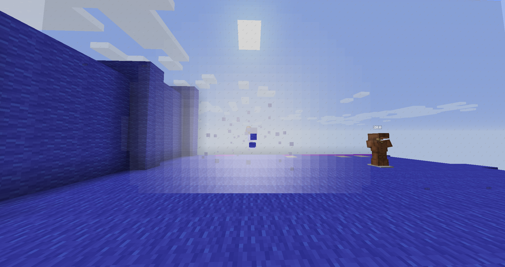

# Sclat v1.0.1 - β


### はじめに
今回からある程度の規模のパッチノートは公式Discordではなく各ページにまとめて知らせることにしました。
見出しと画像が使えてDiscordより見やすい！！


### アップデート概要
今回のアップデートの主要なものは以下となっています

1. インクの上で潜伏できるようになりました
2. 機能拡張のためにサーバーのバージョンを1.13.2から1.14.4へ変更しました
3. 雪玉ではなく羊毛が表示されるようになりました
4. 試合サーバーの待機状態の表示と通知機能を追加しました
5. 金網システムを大幅に軽量化しました
6. マップと武器の追加 + 調整
7. ランクリセット + システム変更

#### **1. 潜伏**
同じ場所でとどまっているときにもパーティクルが表示されていたバグを修正しました

#### **2. バージョンアップ**
機能拡張のためにバージョンアップしました。
これに伴い推奨バージョンが1.13.2から1.14.4へ変更されました

#### **3. 雪玉の表示**
雪玉の代わりに羊毛が表示されるようになりました



#### **4. 待機状態**
試合開始待機が始まった時にロビーサーバーで通知と状態表示を見られるようになりました


#### **5. 金網**
システムの最適化が完了したため各マップの金網を復活させました

弾が金網をすり抜けるようにしました

#### **6. マップと武器**

#### 新マップとマップ調整
新マップ "マサバ海峡大橋" を追加しました


既存のマップ "フローティングロード" をマップローテーションから削除しました

#### 新武器
新しく3つの武器を追加しました
* ボトルガイザー 
* ロングブラスター[ネクロ] 
* ソイチューバー 

ボトルガイザーは連打することによって高速に弾を発射できる武器です

ソイチューバーは最大までチャージせずにチャージキープを使うことができる武器です

#### 武器調整
大暴れしていた武器の性能を抑え込みました...
```text
<メインウエポン>

・パブロ系、ホクサイ系
    振りのダメージを減らしました
    轢きのダメージを減らしました

・ラピッドブラスター系
    直撃のダメージを大幅に減らしました
    爆風のダメージをわずかに減らしました

・ヒーローシューター
    スプラシューターと同じ性能にしました

・スプラシューター系
    一発のダメージを6から7に増やしました

・ケルビン系
    インク効率を上げました

<サブウエポン>

全てのサブウエポンで、使用を試みた直後はインクを回復できなくしました

<スペシャルウエポン>

・ジェットパック
    飛行の高度と移動速度を下げました

<その他>

スペシャルウエポンのチャージに必要な塗りポイントを全体的に引き上げました
```

#### **7. ランクリセット + システム変更**
上位のランク帯に上がれば上がるほど、ランクが上がりにくく下がりやすくなるようにシステムを変更しました。

この変更に伴いランクをリセットしました。

### その他変更

* ガチエリアのカーペットを削除しました


  
* 雪玉の表示に関する設定と各種設定の説明書きを追加しました


  
* ジェットパックのモデルデータを変更しました

 
  
* SEUS等のPBR対応シェーダーでサーバーのリソースパックを読み込んでいるときにインクが反射して見えるようになりました



* H3リールガン系武器とブラスター系武器の直撃演出にエフェクトを追加しました


  

### 最後に
Sclat開発者の_Be4_です。

今回のアップデートを入れた後はしばらくの間、Sclatの開発を休む予定です。

(休むと言いつつ結局やってしまうような気はしますが...)

βテスト終了日はまた後日お知らせします。

今後ともよろしくお願いいたします。