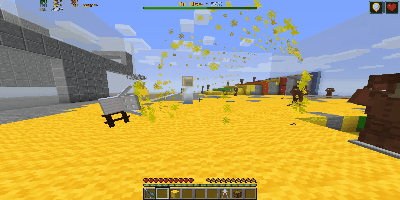

# Sclat v1.0.2 - β


### はじめに
今度こそベータテスト最終アップデートです

前回よりは小規模となっております


### アップデート概要
今回のアップデートの主要なものは以下となっています

1. メガホンレーザーのリワーク
2. 武器追加
3. 武器調整
4. 威力減衰システムの追加
5. その他改善

#### **1. メガホンレーザーのリワーク**
撃つ前に方向を自由に決められるようになりました(真上にも撃てるぜ！)




#### **2. 武器追加**
新しく2つの武器を追加しました
* ジェットスイーパー 
* ジェットスイーパー[カスタム] 


#### **3. 武器調整**

```text
<メインウエポン>

・52-Gal系
    撃ち始めのブレを小さくしました
    スペシャルウエポンをチャージするのに必要な塗りポイントを増やしました

・ボトルガイザー
    一発のインク消費を増やしました

・プライムシューター系
    ダメージを増やしました

・N-zap系
    持っているときの移動速度を少し速くしました
    ダメージをわずかに増やしました
    スペシャルウエポンをチャージするのに必要な塗りポイントを少なくしました

・ローラー系
    タテ振りの仕様を変更して少しリーチを短く、より扱いやすくしました
    降った時に出てくる弾の数を少し増やしました

・スクイックリン
    最大チャージにかかる時間をわずかに長くしました

・キャンピングシェルター系
    発射される弾の数を少し増やしました

・エクスプロッシャー
    直撃のダメージをわずかに増やしました

・H3リールガン
    サブウエポンをセンサーからクイックボムに変更しました
    スペシャルウエポンをマルチミサイルからスーパーセンサーに変更しました
    スペシャルウエポンをチャージするのに必要な塗りポイントを少なくしました

・H3リールガンD   H3リールガン[チェリー]
    スペシャルウエポンをチャージするのに必要な塗りポイントを少なくしました

<サブウエポン>

・トラップ
    ダメージを少し増やしました

<スペシャルウエポン>

・インクストライク
    落ちてくるボムの数を11発から16発に増やしました
    ボムのダメージをわずかに増やしました

・インクアーマー
    見方に付与されるアーマーの耐久値を増やしました

・バリア
    ボム等の爆風で飛ばされるようになりました
    メガホンレーザーで飛ばされるようになりました

・ジェットパック
    移動速度をわずかに下げました
```

#### **4. 威力減衰システムの追加**
ブラスター系とチャージャー系以外のメインウエポンの攻撃に、時間によってダメージが少なくなる仕様を追加しました

これによりリーチの長い武器のダメージが全体的に少し小さくなります。　ダメージは元のダメージと比べて最大で8割まで下がります


#### **5. その他**
* トラップが、倒されたプレイヤーを検知して爆発することがあったバグを修正しました
* バグを防ぐためにスーパージャンプのチャクチ直前に使えるスペシャルウエポンをスーパーチャクチに限定しました
* ランキングが正常に動かないことがあるバグを修正しました
* メイン性能アップのギアがプレイヤーに対して有効ではなかったバグを修正しました


### 最後に
前回のアップデートでしばらく開発停止するといいつつも結局やってしまいました...

ベータテストは4/4終了予定です。

あと一週間ほどよろしくお願いいたします。